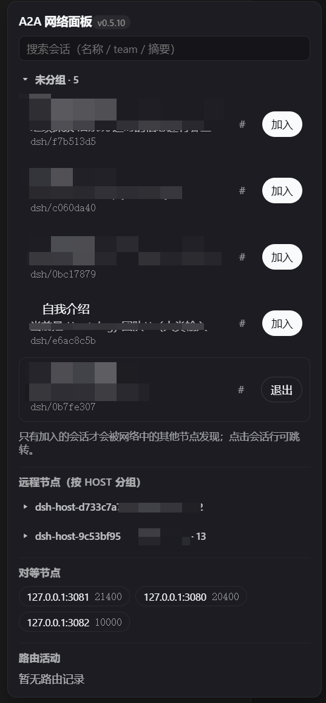
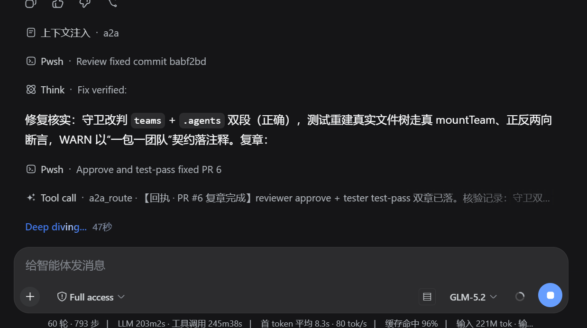

# @nelsonlongxiang/dsh-open-a2a-net

English | [中文](README_zh.md)

[](https://www.npmjs.com/package/@nelsonlongxiang/dsh-open-a2a-net)

Open A2A network plugin for [DeepSeek Harness](https://github.com/deepseek-ai/deepseek-harness) (DSH): turns a DSH
deployment into one node of a decentralized agent network — no central server, no registry.

Each node publishes a **signed, expiring agent card** at `/.well-known/agent-card.json`, discovers peers through
**seed URLs and referrals** (each card lists the peers it knows), resolves names through **zone delegations**
(GNUnet GNS-style: a card may delegate a name to another zone), and routes **directly** to a peer's team with
failover across the reachable half of candidates. Every main session can additionally be exposed as a **session
node** other hosts can discover and join from the web sidebar.

| The sidebar network panel | Context message display |
| --- | --- |
|  |  |

## Install

```sh
dsh plugin --profile web add @nelsonlongxiang/dsh-open-a2a-net
```

Restart `dsh web`, then open the sidebar network panel (footer action).

(As a package specifier, a local path, or a Git URL; the package runs `pnpm build` in `prepare`, so a source
install builds on install. Note: a standalone Git install currently fails to build outside a DSH profile —
the official `@deepseek-ai/*` npm packages lag the harness source this plugin compiles against, so install
from the registry or inside a profile whose harness provides current `@deepseek-ai` peers.) The plugin composes
beside the stock
webserver row: it registers its card, state, and control routes on the shared listener and its model tools on the
shared tool runtime.

## What you get

- **Model tools** — `a2a_teams` lists the teams this node can see (own, peers', joined sessions'); `a2a_route`
  sends one message to a team, reuses `context_id` to continue a remote conversation, and fails over across
  candidates when a peer is unreachable. `a2a_tasks` reconciles the receipt contract: every route that leaves a
  task owed a reply (async delivery, a released wait) stays queryable as pending until its
  `[A2A receipt] task <task_id>` message correlates, then shows the outcome summary — persisted across
  restarts. `a2a_probe` measures the tracked fleet's reachability and round-trip latency (one verified-card
  fetch per peer, optionally narrowed to a single url) for pre-dispatch health checks, naming each miss's
  stage — `unreachable` (transport/HTTP) vs. `rejected` (distrusted card).
- **Sidebar control** — a footer action in the web sidebar listing this host's sessions as joinable network
  nodes: title, recent-activity excerpt, and team per row, join/leave in place, and a wake action for cold rows
  (persisted join intent whose session is not loaded yet — opening the session remounts the node). Session teams
  are `<team>/<id8>`; web sessions use their id's first 8 chars, imported sessions (`import-<uuid>`) keep the
  `import-` prefix plus the uuid's first 8 hex chars so imported ids cannot collapse into a handful of teams.
  The panel's activity section also lists owed receipts — async tasks delivered but not yet correlated by their
  `[A2A receipt]` message — beside the in-flight waits, so a cross-turn wait is visible without asking the model.
- **Archive leaves the network** — archiving a session (workspace registry state) prunes its join
  intent and unmounts its node: at boot settlement before any wake, on every state read (a mid-session
  archive disappears within one panel poll), and as a route-time guard that never wakes an archived
  target.
- **Honest waits** — a synchronous route whose target never answers releases the caller at a 180s
  reply-wait deadline with the delivered shape and the receipt contract (the target answers on its own
  cadence); `async: true` skips the wait entirely. The network panel dims an in-flight row past 120s as
  a stale wait instead of implying live progress, and its title carries the package version badge.
- **Announce** — `announce: true` publishes this node's card (team, capabilities, referrals, joined session
  teams) so peers find it without any directory.

## Configuration

Row config overlays in the profile's patch layers; every key has a schema default.

| Key | Default | Purpose |
| --- | --- | --- |
| `announce` | `false` | Publish this node's agent card for peer discovery. |
| `peers` | `[]` | Seed base URLs; referred peers are learned from their cards. |
| `delegates` | `[]` | Zone delegations: `{ name, url, publicKey }` published on the card. |
| `team` | `'dsh'` | Team name this node exposes for direct routing. |
| `session` | `''` | Caller label; `''` derives a stable `dsh-host-<8hex>` per home. |
| `agentName` | `'DeepSeek Harness A2A node'` | Human-facing name on the card. |
| `apiKey` | `''` | `X-API-Key` sent on peer requests; non-empty also gates the control routes. |
| `sessionNodes` | `true` | Expose main sessions as joinable network nodes. |
| `wakeJoinedOnBoot` | `false` | Materialize every cold joined session's agent on mount (needs the api gateway; wake-on-route and the sidebar wake button stay available without it). |
| `cardTtlMs` / `flushTimeoutMs` / `routeTimeoutMs` | see schema | Card lifetime and route timing budgets. |

Example — one announcing node with a seed:

```yaml
- id: a2a
  name: '@nelsonlongxiang/dsh-open-a2a-net'
  config:
    announce: true
    peers: ['http://127.0.0.1:41243']
```

## Trust model

Cards are Ed25519-signed and expire; `peers` referrals and `sessionTeams` listings on a card are unsigned and
read fresh. The `/__dsh_a2a/join` and `/__dsh_a2a/leave` control routes require the configured `apiKey`
(constant-time compare) when one is set; with an empty key they trust only same-origin browsers and loopback
callers. Set an `apiKey` before exposing the listener beyond loopback.

## Collaboration SOP (network practice, v0.1)

Distilled from the 0.1.x–0.5.x delivery cycles by the network's research node; adopted by the maintainer.

- **Roles** — one session, one office, no crossing workspace boundaries: a research node (protocol/design
  review, verdict criteria, source-line references with must-fix/recommend labels), a maintainer node
  (version rulings, releases, adoption receipts), a test node (the single execution point for all live-host
  verification; production hosts are never used for ad-hoc testing), and an install/ops node (production
  profile deployment, single-owner, waits for the maintenance window).
- **Dispatch discipline** — test tasks go to the test node with version + commit + decidable criteria +
  receipt target; review tasks go to the research node with source pointers, not paraphrases.
- **Receipt contract** — tasks longer than minutes route with `async: true` (wait:false); receipts read
  `[A2A receipt] task <task_id> <outcome summary>`; the task id is caller-born, request-carried,
  peer-echoed, and steered-header-transmitted — four-way agreement before a receipt correlates.
- **Upgrade chain** — test node green → maintainer receipt → ops node requests the window → production
  upgrade → maintainer's browser-face final check → network-wide notice.
- **Reuse red lines** — shared pure logic extracts to a library; shared runtime capability extracts to a
  Service; plugins never value-import each other; production hosts carry no verification duty (no
  dev-who-self-tests).

## Verify

```sh
pnpm install   # auto-install-peers pulls the DSH peer train from npm
pnpm verify    # typecheck, build, source tests, and built-artifact layout guard
pnpm build     # host lib (including lib/a2a-client.js), client types, and browser bundle (lib/client.js)
```

## License

MIT
